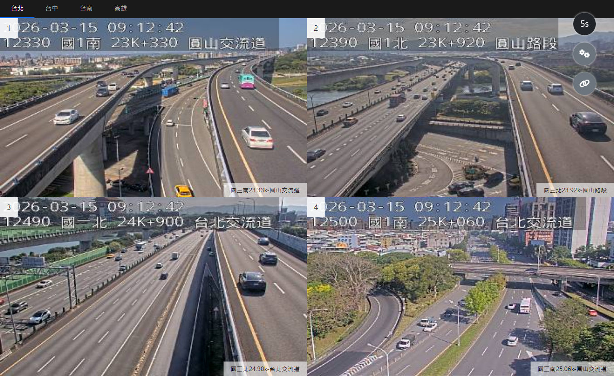

# CCTV Monitor



A lightweight, browser-based dashboard for aggregating and displaying public CCTV image feeds in a unified monitoring grid. Feeds are organized by location, support auto-refresh at configurable intervals, and can be expanded to full-screen view.

## Getting Started

This project is a static web application and requires no server or build tools.

### 1. Configure Camera Sources

Copy the sample data file and edit it with your camera sources:

```bash
cp data/data.js.sample.js data/data.js
```

Open `data/data.js` and update `CCTV_RESOURCES` with your camera groups and image URLs:

```js
const CCTV_RESOURCES = new Map([
    ["Location Name", [
        {
            "title": "Camera Label",
            "url": "https://example.com/camera-feed.jpg",
            "refresh": true
        }
    ]]
]);
```

- **`title`** — Display name shown on the feed tile and modal header.
- **`url`** — Image URL of the camera feed (static JPEG or MJPEG stream).
- **`refresh`** — Set to `true` to append a cache-busting timestamp on every timer tick.

You can also update `CCTV_LINKS` in the same file to customize the sidebar reference links.

### 2. Open in Browser

Open `index.html` directly in your browser — no web server needed.

## Development

### Requirements

- [Node.js](https://nodejs.org/) v18 or later

### Setup

Install dev dependencies:

```bash
npm install
```

### Linting

This project uses [ESLint](https://eslint.org/) for JavaScript and [HTMLHint](https://htmlhint.com/) for HTML. Run both checks before committing:

```bash
npm run lint
```

Run each linter individually if needed:

```bash
npm run lint:js   # JavaScript only
npm run lint:html # HTML only
```

ESLint supports auto-fixing style issues (indentation, quotes, semicolons, etc.). HTMLHint is report-only and does not support auto-fix.

```bash
npm run lint:fix  # Auto-fix JavaScript issues where possible
```
